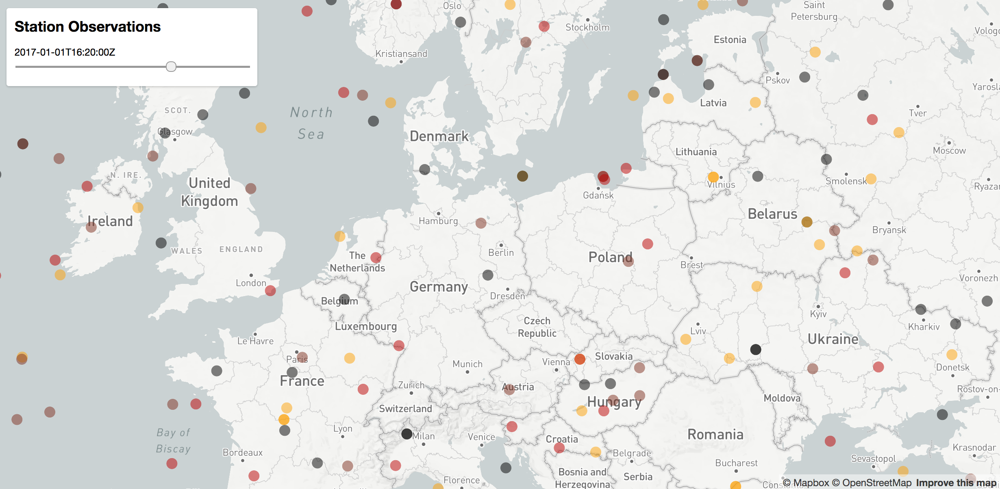

# Mapbox Filter Timeseries Points (Proof of Concept)
Animation of timeseries data via WebGL overlay on Mapbox. Selection of time-related value via [Filters](https://www.mapbox.com/mapbox-gl-style-spec/#types-filter).



## basic concept

GeoJSON contains atomic data points of (1) coordinates (2) value and (3) validity timerange.
```json
  ...
  {
    "type" : "Feature",
    "geometry" : {
      "type" : "Point",
      "coordinates" : [-2.088878872099855,62.408835443652805]
    },
    "properties" : {
      "stationId" : 815,
      "value" : 3.0,
      "validFrom" : "2017-01-01T12:15:00Z",
      "validTo" : "2017-01-01T14:05:00Z"
    }
  }
  ...
```

Mapbox overlay filters the valid data points to a given timestamp.
```
  map.setFilter('observations',
    [
      'all',
      ['<=', 'validFrom', givenTimestamp],
      ['>', 'validTo', givenTimestamp]
    ]);
```

## results
:+1: easy to implement<br />
:+1: explicit validity timerange of obs data, defined by validAt and validFrom<br />
:+1: would work for mobile stations

:-1: data volume (24k features for 10k stations - 24 observations each)<br />
:-1: suboptimal performance (two filters for each data point)

## environment
* npm v4.0.2, node v7.2.0
* java v8, mvn v3 

## server module
* `cd server`

### build and start
1. `mvn spring-boot:run`
2. open `http://localhost:8080/obs`

## client module
* `cd client`

### build and start
0. `npm install`
1. `npm run build && npm run start`
2. open `http://localhost:3000/`

## references
Discontinued PoC of solving the problem with D3 overlay
* https://github.com/dnltsk/mapbox-d3-timeseries-points

Mapbox GL Layer:
* https://www.mapbox.com/mapbox-gl-js/example/data-driven-circle-colors/
* https://www.mapbox.com/mapbox-gl-js/example/timeline-animation/

## next steps
* TypeScript please
http://www.jbrantly.com/typescript-and-webpack/
